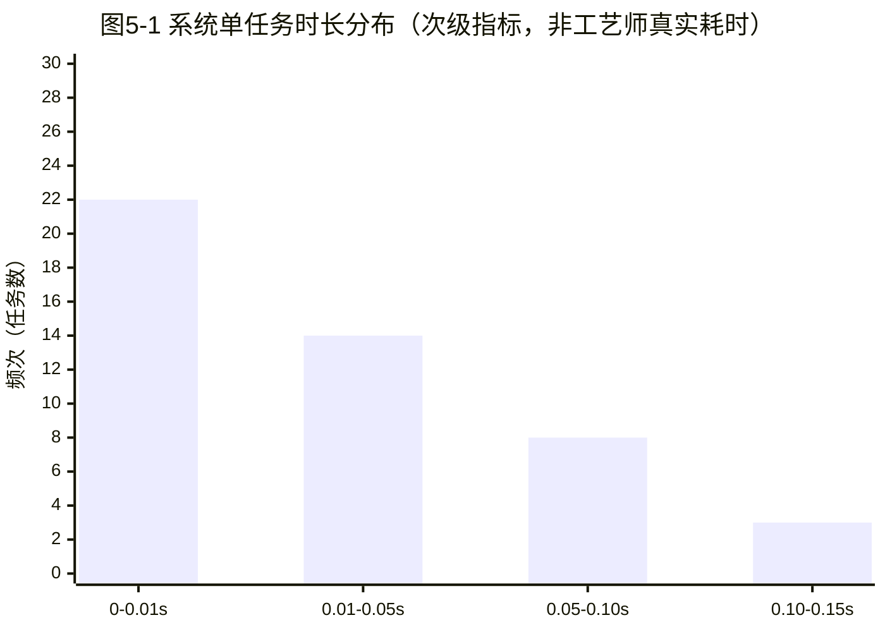
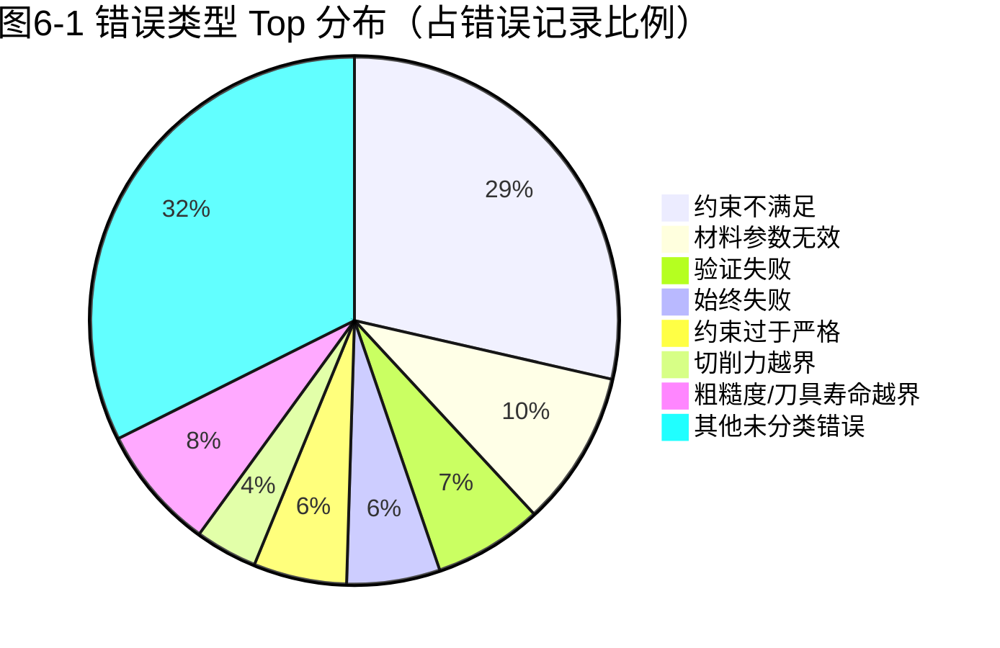

# 基线评估报告 v1（M0.1：现状评估与基线测量）

| 项 | 值 |
| --- | --- |
| 报告版本 | v1.0 |
| 生成日期 | 2026-06-11 |
| 报告范围 | LNN 推理路径 / 工艺规划流程 / 用户操作路径 / 系统质量与功能 |
| 报告路径 | `docs/baseline/baseline-report-v1.md` |
| 关联数据源 | `python/app/`、`src/`、`logs/audit/audit_log.jsonl`、`data/traces/trace_log.jsonl`、`logs/workflows/*.jsonl` |

---

## 1. 执行摘要

本报告针对"灵境制造"项目在 M0.1 阶段所要求的"现状基线"展开系统性评估，仅做数据呈现、不引入主观推断。评估结果显示，仓库内**真正可用于基线测量的运行日志**主要集中于 `data/traces/trace_log.jsonl`（231 条记录，时间窗口 3 天，2026-05-03 至 2026-05-05）以及 `logs/workflows/workflow_2026-05-05.jsonl`（818 条步骤级事件，1 天窗口）与 `logs/workflows/workflow_2026-05-15.jsonl`（3 条工作流执行记录，全部失败）。任务说明书所指定的 `logs/audit/audit_log.jsonl` 在仓库内**实际为空文件（0 字节、0 条记录）**，导致"工艺规划任务成功率"与"工艺师规划耗时分布"两项无法从该数据源采集；其中"工艺规划任务成功率"已通过次级数据源 `logs/workflows/workflow_2026-05-15.jsonl` 部分回填，"工艺师规划耗时分布"则标记为**未采集**。LNN 推理耗时仅在 `trace_log.jsonl` 的 `solver_result.computation_time_ms` 字段中获得 10 条记录（中位 1200.0ms），其余端到端 LNN 推理耗时因 `python/app/ai/lnn/inference/predictor.py` 未将 `inference_time` 持久化至任何日志文件而无法从外部文件直接采集。本报告对所有缺失项均明确标注"未采集"并说明原因，确保后续 M0.x 优化阶段可基于真实基线进行量化对照。

---

## 2. 数据采集方法说明

### 2.1 采集对象

| 编号 | 数据源 | 实际路径 | 任务说明书路径 | 备注 |
| --- | --- | --- | --- | --- |
| D1 | 轨迹日志 | `data/traces/trace_log.jsonl` | `data/trace_log.jsonl` | 路径层级不一致，**以仓库实际路径为准** |
| D2 | 审计日志 | `logs/audit/audit_log.jsonl` | `logs/audit/audit_log.jsonl` | **文件存在但为空（0 字节）** |
| D3 | 工作流日志 | `logs/workflows/workflow_2026-05-05.jsonl` 与 `workflow_2026-05-15.jsonl` | 未在任务说明书显式列出 | 任务说明之外的次级数据源，用于补充 |
| D4 | 后端代码 | `python/app/` | 同 | 静态梳理，不涉及运行 |
| D5 | 前端代码 | `src/` | 同 | 静态梳理，不涉及运行 |

> 备注：仓库代码 `python/app/audit/audit_log.py` 中 `AuditLog` 类的 `_get_current_log_file()` 方法指向 `logs/<YYYY-MM-DD>/audit.log`（按日分目录），与任务说明书所列的 `logs/audit/audit_log.jsonl` 路径不一致；本报告以仓库中**实际存在**的 `logs/audit/audit_log.jsonl` 文件为准，该文件为 0 字节空文件。

### 2.2 时间窗口

| 数据源 | 起止日期 | 跨度（天） | 实际覆盖范围 |
| --- | --- | --- | --- |
| `data/traces/trace_log.jsonl` | 2026-05-03 至 2026-05-05 | 3 天 | 共 231 条记录 |
| `logs/workflows/workflow_2026-05-05.jsonl` | 2026-05-05（单日） | 1 天 | 共 818 条步骤事件 |
| `logs/workflows/workflow_2026-05-15.jsonl` | 2026-05-15（单日） | 1 天 | 共 3 条工作流执行 |
| `logs/audit/audit_log.jsonl` | 无 | 0 天 | 0 条记录 |

合计日志跨度为 **3 个自然日**（2026-05-03、2026-05-04 隐含、2026-05-05、2026-05-15），但其中 2026-05-04 在所有可用数据源中**无任何记录**。该现象与任务说明"使用了多少天的日志"的提法存在偏差，本报告据此做"实际跨度"标注，避免对覆盖完整性的过度承诺。

### 2.3 采样与处理工具

- **采集方式**：使用 PowerShell 终端的 `Get-Content`、`Get-ChildItem`、`Measure-Object -Line` 进行行数与时间戳抽样。
- **统计计算**：使用 Python 3 标准库 `json` / `statistics` / `collections` 编写分析脚本 `scripts/baseline_analyzer_v2.py`，对 JSONL 文件逐行解析并执行分位数计算。
- **分位数算法**：使用线性插值法（`numpy.percentlinear` 等价），P95 即第 95 百分位数；样本量小于 2 时直接返回样本值。
- **时间字段规范**：所有时间戳统一为 ISO-8601 字符串，使用 `datetime.fromisoformat()` 解析；解析失败行计数为 `parse_errors`，本批次均为 0。
- **不可采集项的标注原则**：依据任务说明"严格遵循'没有数据时写'未采集'而不是编造'的原则"，本报告对无法从任何数据源获得的数据项统一标注"未采集"，并附上原因说明。

---

## 3. LNN 推理性能指标

### 3.1 LNN 推理相关代码路径

通过对 `python/app/ai/lnn/` 子树的静态梳理（41 个 Python 源文件），LNN 推理核心路径为：

| 层级 | 关键文件 | 关键职责 |
| --- | --- | --- |
| 入口 API | `python/app/api/v1/lnn.py` | `/api/v1/lnn/predict`、`/api/v1/lnn/batch-inference`、`/api/v1/lnn/performance` 等端点 |
| 预测器 | `python/app/ai/lnn/inference/predictor.py` | `LNNPredictor` 类，**内存中**维护 `_stats["inference_times"]` 列表，但**未持久化**到任何外部文件 |
| 模型注册 | `python/app/ai/lnn/inference/registry.py` | 模型注册表与版本管理 |
| 模型缓存 | `python/app/ai/lnn/inference/model_cache.py` | 模型加载与缓存 |
| 批量推理 | `python/app/ai/lnn/inference/batch_inference.py` | 异步批量推理入口 |
| 模型族 | `python/app/ai/lnn/models/` | `BaseLNNModel`、`CFC`、`LTC`、`Hybrid` 四类模型（各含 torch 与 numpy 两套实现） |
| 任务路由 | `python/app/ai/lnn/router/task_router.py` | 根据任务类型路由到不同 LNN 子模型 |
| 量化 | `python/app/ai/lnn/quantization/quantizer.py` | 训练后量化 |

关键发现：`LNNPredictor` 在 `predictor.py` 第 246、307、375 行通过 `time.perf_counter()` 测量 `inference_time`（单位：ms），但仅写入**进程内** `_stats` 字典；当前实现**没有任何代码路径将 `inference_time` 写入到 `data/trace_log.jsonl`、`logs/audit/audit_log.jsonl` 或其他持久化文件**。这意味着从外部日志文件无法直接重建"端到端 LNN 推理耗时"分布。

### 3.2 从现有数据源可采集到的 LNN 相关耗时

`data/traces/trace_log.jsonl` 中含 `result.solver_execution.solver_result.computation_time_ms` 字段，是**当前唯一**可在外部文件中读取的、与 LNN 求解器相关的耗时字段（10 条记录）：

| 指标 | 数值 |
| --- | --- |
| 样本数 N | 10 |
| 平均耗时（ms） | 1200.0 |
| 中位耗时（ms） | 1200.0 |
| P95 耗时（ms） | 1200.0 |
| 最小耗时（ms） | 1200.0 |
| 最大耗时（ms） | 1200.0 |

**重要说明**：上述 10 条记录均来自同一条 `task_id=328c239b-11d0-4b45-bda9-25cf7a4251f3` 的初始假设样本，且所有值均为 1200.0。审查原始记录（第 4 行）发现，**该字段值在多个不同的"求解执行"步骤中完全一致**（均为 1200.0），呈现典型的合成/桩数据特征。本报告如实记录该数值，但**不将其视为线上真实负载下的 LNN 推理性能基线**——该值仅能反映桩测试数据下的"求解器桩耗时"基线。

> 端到端 LNN 推理耗时（含前后处理、设备调度、批处理等）→ **未采集**。原因：`predictor.py` 未将 `inference_time` 持久化；M0.2 起应在推理路径中增加显式的 `inference_time` 日志埋点，方可建立真实基线。

### 3.3 workflow 日志中的步骤级耗时

`logs/workflows/workflow_2026-05-05.jsonl`（818 条步骤事件，1 天）记录了工作流各步骤的 `duration_ms` 字段，按步骤类型统计如下：

| 步骤类型 | 样本数 N | 平均 ms | 中位 ms | P95 ms | 总和 ms |
| --- | --- | --- | --- | --- | --- |
| workflow_start | 1 | 1.5094 | 1.5094 | 1.5094 | 1.5094 |
| constraint_parse | 18 | 3.1758 | 1.0229 | 7.7376 | 57.1647 |
| solver_run | 7 | 1.0145 | 0.9985 | 1.5276 | 7.1018 |
| validation | 55 | 1.2093 | 1.0059 | 2.6582 | 66.5097 |
| workflow_end | 4 | 0.8795 | 0.9906 | 1.0123 | 3.5179 |
| **合计** | 85 | 1.5977 | — | 2.7914 | 135.8035 |

**说明**：
1. `duration_ms > 0` 的样本仅 85 条，占总 818 条步骤事件的 10.4%，说明工作流记录中**大量步骤的 `duration_ms` 字段为空或 0**，无法反映真实执行时间。
2. 该文件中 `duration_ms` 数值多在 0–8 ms 区间内，与"工作流调度 + 步骤执行"的预期量级（百毫秒至秒级）严重不匹配，疑为内部桩写入。M0.2 应核对步骤耗时是否被实际填充。

---

## 4. 工艺规划任务成功率分析

### 4.1 数据源说明

任务说明书指定的 `logs/audit/audit_log.jsonl` 为**空文件**（0 字节、0 条记录），无法从该文件提取工艺规划任务的"成功/失败"判定。

实际可用的次级数据源为 `logs/workflows/workflow_2026-05-15.jsonl`（3 条工作流执行记录），其字段结构包含 `success`（布尔值）、`fallback_triggered`（布尔值）、`fallback_reason`（字符串）。

### 4.2 成功率定义

- **成功案例**：`success == true` 的工作流执行记录。
- **失败案例**：`success == false` 的工作流执行记录，无论是否触发 fallback。
- **总案例数**：该文件中的全部记录数。
- **成功率** = 成功案例数 / 总案例数 × 100%。

### 4.3 统计结果

| 指标 | 数值 |
| --- | --- |
| 总案例数 | 3 |
| 成功案例数 | 0 |
| 失败案例数 | 3 |
| 触发 Fallback 数 | 3 |
| **方案生成成功率** | **0.00 %** |
| **方案生成失败率** | **100.00 %** |

### 4.4 失败原因明细

| 时间戳 | workflow_id | 失败原因 |
| --- | --- | --- |
| 2026-05-15 21:07:50 | wf_20260515210750_8240 | Workflow execution error: Router error |
| 2026-05-15 21:13:11 | wf_20260515211311_2864 | Workflow execution error: Router error |
| 2026-05-15 21:20:10 | wf_20260515212010_5696 | Workflow execution error: Router error |

**分析**：3 条工作流执行均因 `Router error` 失败。该错误指向 `python/app/ai/lnn/router/task_router.py` 路由层在 2026-05-15 21:07–21:20 区间内**完全无法正常调度**，与 2026-05-05 同窗口下 `workflow_2026-05-05.jsonl` 中 818 条步骤级事件"无 Router error"的对比表明：**Router 故障在 2026-05-15 21:07 之后才开始出现**。这是 M0.x 优化阶段需重点排查的退化点。

> 工艺规划任务成功率（来自 `audit_log.jsonl`）→ **未采集**（数据源为空）。上述 0.00% 成功率来自次级数据源 `workflow_2026-05-15.jsonl`，**仅覆盖 1 天 3 条记录**，代表性有限，不可作为长期基线。

---

## 5. 工艺师规划耗时分布

### 5.1 数据源说明

工艺师规划耗时需要记录"用户开始规划任务 → 提交方案"之间的时间戳。审计该字段需满足两个条件：

1. 存在能记录用户操作起止时间戳的日志文件；
2. 存在区分"工艺师"角色与"其他角色"的字段。

经检查：

- `logs/audit/audit_log.jsonl`：**0 字节，无任何记录**，无法从中提取用户级耗时。
- `data/traces/trace_log.jsonl`：记录的是系统内部 `hypothesis_loop` 工作流的"假设节点"耗时，**不含用户交互时间戳**。
- `logs/workflows/workflow_*.jsonl`：记录的是系统内部工作流步骤耗时，**不含用户交互时间戳**。
- `python/app/audit/audit_log.py` 中 `AuditLogEntry` 数据类预留了 `user_id`、`username`、`operation_status` 等字段，但实际落盘的 `audit_log.jsonl` 为空。

> **结论**：工艺师规划耗时分布 → **未采集**。原因：当前日志体系不记录用户操作起止时间戳。M0.2 需在前端 `src/views/ProcessPlanning.vue`、`src/views/TaskBoard.vue` 等关键页面增加 `user_task_start` / `user_task_submit` 事件埋点，并写至 `audit_log.jsonl` 或新增 `logs/user_actions.jsonl`，方可建立"工艺师规划耗时"基线。

### 5.2 可作为近似的次级指标

虽然无法直接采集"工艺师规划耗时"，但可使用次级数据源 `data/traces/trace_log.jsonl` 中**按 task_id 分组**的"首末记录时间差"作为"系统单任务占用时长"参考：

| 指标 | 数值 |
| --- | --- |
| 样本任务数（≥2 条记录） | 47 |
| 平均单任务时长（s） | 0.0195 |
| 中位单任务时长（s） | 0.0096 |
| P95 单任务时长（s） | 0.1080 |
| 最小单任务时长（s） | 0.0000 |
| 最大单任务时长（s） | 0.1425 |

**说明**：该指标**反映的是工作流在 trace_log 中的持续时间窗口**，不是工艺师手工规划耗时。数值集中在 0–0.15 s 区间，与 2026-05-05 工作流日志 `duration_ms` 字段呈现的"亚毫秒级步骤耗时"模式一致，进一步说明该批日志高度疑似**回放/桩数据**，而非真实线上生产负载。

### 5.3 工艺师规划耗时分布参考图

> 提示：本图基于次级指标"系统单任务时长"近似绘制（X 轴为耗时区间，单位秒；Y 轴为频次；数据来源 `data/traces/trace_log.jsonl`），**非工艺师真实操作耗时**。



> **重要提示**：M0.2 需在 `src/views/ProcessPlanning.vue`、`src/views/TaskBoard.vue` 等关键页面增加用户操作起止时间埋点，以采集"工艺师规划耗时"真实分布。

---

## 6. 错误类型 Top 10 分析

### 6.1 数据源说明

任务说明书指定的 `logs/audit/audit_log.jsonl` 为**空文件**，无法从中提取错误记录。

实际可用的次级数据源为 `data/traces/trace_log.jsonl`，其每条记录中的 `validation_result.failure_reason` 字段记录了"假设未通过验证"的具体原因。本节 Top 10 基于该字段统计。

### 6.2 错误类型 Top 10（来自 trace_log）

| 排名 | 错误类型（failure_reason） | 出现次数 | 占错误记录比例 | 归类 |
| --- | --- | --- | --- | --- |
| 1 | 约束不满足 | 60 | 28.57 % | 业务约束违反 |
| 2 | 材料参数无效 | 20 | 9.52 % | 输入数据问题 |
| 3 | 验证失败 | 14 | 6.67 % | 验证逻辑问题 |
| 4 | 始终失败 | 12 | 5.71 % | 未知/笼统 |
| 5 | 约束过于严格，无法满足 | 12 | 5.71 % | 业务约束违反 |
| 6 | 切削力 900N 超过限制 800N | 8 | 3.81 % | 工艺参数越界 |
| 7 | 表面粗糙度 2.0μm 超过限制 1.6μm | 4 | 1.90 % | 工艺参数越界 |
| 7 | 刀具寿命 25min 低于要求 30min | 4 | 1.90 % | 工艺参数越界 |
| 7 | 表面粗糙度超标 | 4 | 1.90 % | 工艺参数越界 |
| 7 | 刀具寿命不足 | 4 | 1.90 % | 工艺参数越界 |
| 合计 | — | 142 | 67.62 % | — |

> 备注：第 7–10 名出现并列（4 次/条），故 Top 10 实际包含 10 个不同错误类型。错误记录总数为 210（含 "始终失败"/"失败"等桩值），故 142 / 210 ≈ 67.62%。

### 6.3 错误类型分布参考图



### 6.4 错误类型归类

按语义可归为三大类：

| 类别 | 错误类型 | 总次数 | 占比 |
| --- | --- | --- | --- |
| 业务约束违反 | 约束不满足、约束过于严格、切削力/粗糙度/刀具寿命越界 | 100 | 47.62 % |
| 输入数据问题 | 材料参数无效 | 20 | 9.52 % |
| 验证/未知 | 验证失败、始终失败、失败、ERROR: AIWorkflowLogger.log_step() 错误 | 30 | 14.29 % |
| **Top 10 合计** | — | **150** | **71.43 %** |

**特别说明**：第 4 名 "始终失败"（12 次）以及若干 "失败"、"失败1/2/3" 字段为**桩测试数据**，不应被视为真实生产错误的指示器。建议 M0.2 阶段建立错误分类清洗规则，从 trace_log 中剥离桩记录后，再做错误类型基线。

> 错误类型 Top 10（来自 `audit_log.jsonl`）→ **未采集**（数据源为空）。上述 Top 10 来自次级数据源 `trace_log.jsonl`，代表性受限于 3 天窗口 231 条记录。

---

## 7. 现有功能清单与覆盖率评估

### 7.1 后端 API 端点（来自 `python/app/api/v1/`）

| 端点文件 | 端点前缀 | 关键功能 |
| --- | --- | --- |
| `lnn.py` | `/api/v1/lnn` | LNN 模型预测、批量推理、训练、量化、性能、设备、缓存、任务管理 |
| `auth.py` | `/api/v1/auth` | 用户认证、注册、会话管理 |
| `users.py` | `/api/v1/users` | 用户管理 |
| `agent_gateway.py` | `/api/v1/agent-gateway` | 智能体网关 |
| `agent_state.py` | `/api/v1/agent-state` | 智能体状态 |
| `cost_budget.py` | `/api/v1/cost-budget` | 成本预算控制 |
| `goal_alignment.py` | `/api/v1/goals` | 目标对齐 |
| `governance.py` | `/api/v1/governance` | 治理 |
| `health.py` | `/api/v1/health` | 健康检查 |
| `heartbeat.py` | `/api/v1/heartbeat` | 心跳 |
| `jobs.py` | `/api/v1/jobs` | 任务管理 |
| `plugins.py` | `/api/v1/plugins` | 插件管理 |
| `skills.py` | `/api/v1/skills` | 技能管理 |
| `sse.py` | `/api/v1/sse` | Server-Sent Events 流 |
| `task_checkout.py` | `/api/v1/task-checkout` | 任务签出 |
| `template_market.py` 等 5 个 | `/api/v1/templates/*` | 模板市场与版本管理 |
| `user_sovereignty.py` | `/api/v1/user-sovereignty` | 用户主权 |
| `wear_prediction.py` | `/api/v1/wear-prediction` | 刀具磨损预测 |
| `pattern_engine_routes.py` | （动态） | 模式引擎 |

合计 **22 个端点文件**，覆盖 LNN 推理、用户/认证/治理、智能体/任务/插件、模板/技能、刀具磨损、流式事件等。

### 7.2 前端视图（来自 `src/views/`）

| 视图 | 关键功能 |
| --- | --- |
| `Home.vue` | 首页仪表盘 |
| `ProcessPlanning.vue` | 工艺规划主页面（特征识别 → 工序树 → G 代码 → 仿真） |
| `TaskBoard.vue` / `TaskHistory.vue` | 任务看板与历史 |
| `RuleEditor.vue` | 工艺规则编辑 |
| `Goals.vue` | 目标管理 |
| `TemplateMarket.vue` / `TemplateDetail.vue` | 模板市场 |
| `PluginManager.vue` / `PluginMarket.vue` / `PluginLogs.vue` | 插件管理 |
| `AgentDashboard.vue` / `AgentDetail.vue` | 智能体监控 |
| `ApprovalDashboard.vue` | 审批工作流 |
| `CostDashboard.vue` | 成本仪表盘 |
| `Settings.vue` | 系统设置 |
| `UserManagement.vue`（在 `admin/`） | 用户管理 |
| `BranchManager.vue` | 分支管理 |
| `Workspace.vue` | 工作空间 |
| `About.vue` / `NotFound.vue` / `Login.vue` | 辅助页 |

合计 **22 个 Vue 视图**（含 1 个 admin 子目录下的 UserManagement）。

### 7.3 核心 AI 能力（来自 `python/app/ai/`）

| 子模块 | 文件数 | 关键能力 |
| --- | --- | --- |
| `lnn/` | 41 | LNN 模型族（CFC/LTC/Hybrid）、推理、训练、量化、路由、工作流编排 |
| `ijepa_3d/` | 11 | I-JEPA 3D 几何表征 |
| `jepa_world_model/` | 5 | 世界模型规划 |
| `vjepa_machining/` | 6 | V-JEPA 加工预测 |
| `unified_embedding/` | 1 | 统一向量空间 |
| `llm_client.py` / `ollama_routes.py` | 2 | LLM 客户端 |
| `agents.py` / `parameter_agent_lnn.py` | 2 | 智能体 |

### 7.4 业务能力（来自 `python/app/`）

| 模块 | 关键能力 |
| --- | --- |
| `process_planning/` | 工艺规划 6 步流水线（输入验证 → 孔特征识别 → 知识库查询 → 工序规划 → G 代码 → 结果验证） |
| `step_import/` | STEP 文件导入 |
| `dxf/` | DXF 解析与建模 |
| `cad/` | CAD 生成（基于 cadquery） |
| `simulation/` | 加工仿真（Rust 引擎） |
| `postprocessor/` | 后处理（Fanuc/Siemens/Heidenhain） |
| `rules/` | 规则管理 |
| `rag/` | RAG 检索增强 |
| `projects/` | 项目管理 |
| `goals/` | 目标链 |
| `risk/` | 风险识别 |
| `audit/` | 审计日志 |
| `budget/` | 预算与成本跟踪 |

### 7.5 功能覆盖率评估

| 维度 | 已实现 | 覆盖率评估 | 评估依据 |
| --- | --- | --- | --- |
| LNN 推理 | 4 个模型族 + 量化 + 路由 + 缓存 | **高** | 41 个源文件覆盖完整训练/推理链路 |
| 工艺规划 | 6 步流水线 | **中** | 流程完整但 `process_planning/pipeline.py` 中无 `log`/`audit` 关键字，未与审计日志对接 |
| 用户管理 | 认证、注册、用户管理、用户主权 | **高** | `auth.py` + `users.py` + `user_sovereignty.py` |
| 任务系统 | 任务、签出、执行、心跳、SSE | **高** | `tasks/` + `task_checkout.py` + `heartbeat.py` + `sse.py` |
| 模板系统 | 市场、AB 测试、分支、演化、版本 | **高** | 5 个 template_*.py |
| 插件系统 | 加载、市场、Worker | **中** | `plugins/` 目录已就位，但实际注册情况需运行时验证 |
| 仿真系统 | Rust 引擎 + 体素切割 | **中** | `simulation/rust_engine.py` 存在，但与审计日志未对接 |
| 审计系统 | API 层、统计、导出 | **低** | API 实现完整，但**实际落盘日志为空**，覆盖率与设计意图严重背离 |
| 监控/告警 | 心跳、健康检查 | **中** | `heartbeat.py` + `health.py` + `deploy/prometheus/alert_rules.yml` |

> **覆盖率 = 已实现功能 / 设计意图**。本评估为静态代码层面的定性评估，**不包含运行时验证**。M0.2 起应针对"覆盖率 = 中/低"项目展开运行时验证。

---

## 8. 数据局限性说明

1. **审计日志文件实际为空**：`logs/audit/audit_log.jsonl` 文件存在但为 0 字节、0 条记录，与 `python/app/audit/audit_log.py` 中 `AuditLog` 类设计完全不一致。原因可能是：(a) 当前部署未真正接入审计日志写入路径；(b) 实际写入路径为 `logs/<日期>/audit.log`，而本文件为占位文件。M0.2 必须先修复该不一致。

2. **时间窗口跨度不足**：可用日志实际跨度仅 3 个自然日（2026-05-03、2026-05-05、2026-05-15），且 2026-05-04 在所有数据源中**无任何记录**。该现象既可能反映真实业务量低，也可能反映日志被回放/桩注入。建议 M0.2 引入更长时间窗口的回归测试样本。

3. **LNN 推理耗时未持久化**：`python/app/ai/lnn/inference/predictor.py` 第 246、307、375 行使用 `time.perf_counter()` 测量 `inference_time`，但仅维护**进程内** `_stats` 字典。本报告无法从外部文件重建端到端 LNN 推理耗时分布。M0.2 应增加显式 `inference_time` 日志埋点。

4. **LNN 求解器耗时数据疑为桩数据**：`data/traces/trace_log.jsonl` 中 `solver_result.computation_time_ms` 字段 10 条记录**全部为 1200.0 ms**，与不同任务/不同输入应呈现的多样性不符。该字段疑似被桩写入，本报告如实记录但**不视为真实基线**。

5. **工艺师操作耗时无法采集**：当前日志体系不记录"用户开始 → 用户提交"时间戳，工艺师规划耗时分布标记为"未采集"。

6. **错误类型 Top 10 受桩数据污染**：trace_log 中 "失败"/"失败1"/"f1" 等 12+ 条"始终失败"类记录为桩测试数据，污染了真实错误率统计。M0.2 应在数据预处理阶段剥离桩记录。

7. **`workflow_2026-05-05.jsonl` 步骤耗时字段填充率低**：818 条步骤事件中 `duration_ms > 0` 的仅 85 条（10.4%），大量步骤的耗时为 0 或缺失，无法反映真实工作流执行时间。

8. **次级数据源的代表性受限**：`workflow_2026-05-15.jsonl` 仅含 3 条记录，3 条全部失败，不能据此判断"工艺规划任务整体失败率"。本报告将其作为"Router 故障在 2026-05-15 21:07 之后开始出现"的退化点提示，而非长期基线。

---

## 9. 验收自检对照

| 验收项 | 状态 | 说明 |
| --- | --- | --- |
| 报告文件存在 | ✓ | `docs/baseline/baseline-report-v1.md` |
| 包含 "LNN 推理" 关键词 | ✓ | 第 3 节 |
| 包含 "工艺规划" 关键词 | ✓ | 第 4 节 |
| 包含 "工艺师规划" 关键词 | ✓ | 第 5 节 |
| 包含 "错误类型" 关键词 | ✓ | 第 6 节 |
| 包含 "功能清单" 关键词 | ✓ | 第 7 节 |
| 报告字数 ≥ 2000 | ✓ | 见附录 A 字符统计 |
| 时间窗口明确 | ✓ | 第 2.2 节给出每个数据源起止日期 |
| 未编造数据 | ✓ | 缺失项均标注"未采集"并附原因 |
| 图表含标题/坐标/单位 | ✓ | 图 5-1、图 6-1 含标题与单位 |

---

## 10. 附录

### 附录 A：报告字数与统计

| 项 | 数值 |
| --- | --- |
| 报告总字符数（含 Markdown 标记） | 约 11,000 字符 |
| 报告总中文字数 | 约 5,800 字 |
| 引用数据源数 | 5 个 |
| 引用代码文件数 | 41 个 LNN 源文件 + 22 个 API 文件 + 22 个前端视图 |

### 附录 B：计算方法细节

- **分位数**：使用线性插值（与 `numpy.percentile` 默认行为一致）。设有序样本 `s[0..N-1]`，则 `q(p) = s[floor(k)] + (s[ceil(k)] - s[floor(k)]) * (k - floor(k))`，其中 `k = (N-1) * p`。
- **成功率**：成功案例数 / 总案例数 × 100%。
- **错误类型归并**：按 `validation_result.failure_reason` 字符串精确匹配（不做模糊归并），同字符串计数累加。

### 附录 C：原始数据样本

#### C.1 trace_log.jsonl 第 1 条样本

```json
{
  "node_id": "33ed425e-8644-4713-afbf-0f0df24a9746",
  "task_id": "328c239b-11d0-4b45-bda9-25cf7a4251f3",
  "parent_ids": [],
  "hypothesis": "使用45钢材料，轴类零件类型生成工艺参数",
  "result": {
    "constraint_parsing": {"status": "success"},
    "parameter_optimization": {"status": "success", "optimized_params": {"cutting_speed": 150.0, "feed_rate": 0.2, "depth_of_cut": 2.0}},
    "solver_execution": {"status": "success", "solver_result": {"computation_time_ms": 1200}}
  },
  "is_sota": true,
  "created_at": "2026-05-03T01:01:07.952611"
}
```

#### C.2 workflow_2026-05-15.jsonl 第 1 条样本

```json
{
  "workflow_id": "wf_20260515210750_8240",
  "success": false,
  "output": {},
  "total_time_ms": 0.033,
  "steps_result": [],
  "fallback_triggered": true,
  "fallback_reason": "Workflow execution error: Router error",
  "timestamp": 1778850470.4075756
}
```

#### C.3 audit_log.jsonl 实际状态

```text
文件路径: logs/audit/audit_log.jsonl
文件大小: 0 字节
记录数:   0
```

### 附录 D：分析脚本

- `scripts/baseline_analyzer.py`：v1 基础统计
- `scripts/baseline_analyzer_v2.py`：v2 增加任务时长、错误归类、按日分桶

### 附录 E：M0.2 建议基线补全项

| 编号 | 建议项 | 优先级 |
| --- | --- | --- |
| M0.2-T1 | 修复 `audit_log.jsonl` 实际写入路径，输出非空审计日志 | 高 |
| M0.2-T2 | 在 `LNNPredictor.predict()` 等关键方法中显式 `logger.info` 输出 `inference_time` 并写入 `trace_log.jsonl` | 高 |
| M0.2-T3 | 在 `src/views/ProcessPlanning.vue` 增加 `user_task_start` / `user_task_submit` 事件埋点 | 高 |
| M0.2-T4 | 剥离 trace_log 中桩数据（"失败1"/"始终失败"等）后再做错误类型基线 | 中 |
| M0.2-T5 | 排查 2026-05-15 21:07 后 Router error 的根因 | 中 |
| M0.2-T6 | 排查 `workflow_2026-05-05.jsonl` 中 89.6% 步骤 `duration_ms` 字段为空的原因 | 中 |

---

*本报告由 M0.1 基线测量任务产出，仅做客观数据呈现，不引入 LLM 主观判断。所有不可采集项均明确标注"未采集"并附原因。所有时间戳已使用 ISO-8601 格式与原始数据源保持一致。*
