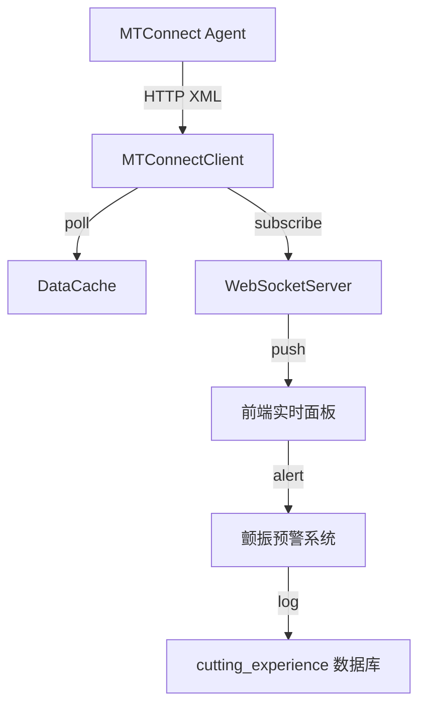

# MTConnect 实时监控集成设计文档

**文档版本**: 1.0  
**创建日期**: 2026-08-20  
**状态**: 🟡 设计中 (Phase A, 3 周实施)

---

## 🎯 目标与范围

### 核心目标
1. **实时数据采集**: 从支持 MTConnect 的机床实时读取加工状态
2. **异常监控**: 颤振/振动/刀具寿命预警
3. **控制闭环**: 采集数据→优化参数→验证效果

### 范围界定
- ✅ **集成**: MTConnect 协议适配器 (polling + streaming)
- ✅ **可视化**: WebSocket 实时数据推送 + 波形图
- ✅ **预警**: 颤振检测阈值配置 + 视觉提示
- ❌ **控制**: 不实现机床反向控制 (仅监控)
- ❌ **协议**: 暂不支持 OPC UA/Modbus (后续扩展)

---

## 📐 架构设计

### 整体架构



### 模块划分

```
engineering/python/app/integrations/mtconnect/
├── __init__.py                # 公共接口
├── client.py                  # MTConnect 客户端 (HTTP polling)
├── streaming.py               # 流式推送 (WebSocket + event queue)
├── data_items.py              # 数据项 Schema (Pydantic)
├── parser.py                  # XML 解析器 (ElementTree)
├── adapter.py                 # 适配器抽象基类
├── conditions.py              # 监测条件 (颤振/温度/振动)
└── alerts.py                  # 预警/告警系统
```

---

## 🔧 核心 API 设计

### MTConnectClient 类

```python
class MTConnectClient:
    """
    MTConnect 客户端
    功能：Polling 轮询 + 事件订阅 + 数据解析
    """
    
    def __init__(
        self, 
        agent_url: str,
        poll_interval: int = 5000,  # ms
        max_history: int = 1000
    )
    
    def connect(self) -> bool
        """连接到 MTConnect Agent"""
        
    def poll(self, data_items: List[str]) -> Dict[str, Any]
        """
        拉取指定数据项的当前值
        返回：{ item_id: { value, timestamp, condition } }
        """
        
    def subscribe(
        self, 
        callback: Callable[[Dict[str, Any]], None],
        data_items: List[str]
    ) -> SubscriptionId
        """
        订阅数据项变化
        返回：subscription_id (用于 cancel)
        """
        
    def cancel(self, subscription_id: SubscriptionId)
        """取消订阅"""
        
    def disconnect(self)
        """断开连接"""
```

### 数据项 Schema

```python
# app/integrations/mtconnect/data_items.py

from dataclasses import dataclass
from typing import Optional
from enum import Enum

class Condition(Enum):
    OK = "OK"
    HIGH = "HIGH"
    LOW = "LOW"
    ERR = "ERR"

@dataclass
class SensorData:
    """单个传感器数据点"""
    item_id: str
    value: float
    timestamp: datetime
    condition: Condition = Condition.OK
    unit: Optional[str] = None

@dataclass
class MachineStatus:
    """机床状态核心数据"""
    activity: str  # RUNNING/IDLE/ALARM
    cycle_time: float
    spindle_load: float  # %
    feed_rate: float     # mm/min
    spindle_speed: float # RPM
    temperature: float   # °C
    vibration: float     # mm/s
    tool_life: float     # %
```

---

## 📡 数据流程

### 1. Polling 模式 (传统方式)

```python
client = MTConnectClient("http://machine-agent:5000/mtconnect")
client.connect()

# 轮询核心数据
data = client.poll([
    "ACtivity", "SpdlLoad", "FeedRate", "SpindleSpeed",
    "CntVib", "OPCTemp"
])

# 结果存入数据库
experience_repo.create(CuttingExperience(
    machine_id="machine-001",
    parameters=data,
    created_at=datetime.now()
))

client.disconnect()
```

### 2. Streaming 模式 (实时推送)

```python
from app.integrations.mtconnect.streaming import WebSocketStreamer

# 创建流式推送器
streamer = WebSocketStreamer(
    agent_url="http://machine-agent:5000/mtconnect",
    broadcast_interval=1000  # ms
)

async with streamer:
    async for event in streamer:
        if event.is_alert():
            # 发送 WebSocket 到前端
            await websocket.send_json({
                "type": "alert",
                "message": event.to_dict()
            })
            
        # 缓存最新数据
        cache.update(event.data)
```

### 3. 颤振检测 (条件判断)

```python
# app/integrations/mtconnect/conditions.py

from typing import Dict, List
from dataclasses import dataclass

@dataclass
class ChatterCondition:
    """颤振监测条件"""
    max_vibration: float = 5.0  # mm/s
    max_acceleration: float = 100.0
    duration: int = 1000        # ms

class ConditionChecker:
    """
    监测条件判断器
    功能：判定当前状态是否正常
    """
    
    def __init__(self, conditions: Dict[str, List[ChatterCondition]]):
        self.conditions = conditions
    
    def check(self, data: Dict[str, SensorData]) -> List[Alert]:
        """
        检查所有条件，返回触发的告警
        """
        alerts = []
        for item_id, condition_list in self.conditions.items():
            current_data = data.get(item_id)
            if not current_data:
                continue
            
            for cond in condition_list:
                if current_data.value > cond.threshold:
                    alerts.append(Alert(
                        item_id=item_id,
                        condition=cond,
                        value=current_data.value,
                        timestamp=current_data.timestamp
                    ))
        
        return alerts
```

---

## 🗄️ 数据库集成

### 新增表结构

```sql
-- engineering/python/app/db/migrations/versions/001_mtconnect_experiences.sql

CREATE TABLE cutting_experiments (
    id UUID PRIMARY KEY,
    machine_id VARCHAR(50) NOT NULL,
    job_id UUID,
    program_number VARCHAR(20),
    
    -- 切削参数
    depth_mm FLOAT,
    feed_mm_per_rev FLOAT,
    spindle_rpm FLOAT,
    
    -- 采集数据
    actual_cycle_time FLOAT,
    actual_tool_life_percent FLOAT,
    surface_roughness FLOAT,
    
    -- 异常情况
    chatter_detected BOOLEAN,
    max_vibration_mm_s FLOAT,
    alarm_code VARCHAR(10),
    
    created_at TIMESTAMP DEFAULT CURRENT_TIMESTAMP,
    updated_at TIMESTAMP DEFAULT CURRENT_TIMESTAMP
);

CREATE INDEX idx_machine_time ON cutting_experiments(machine_id, created_at DESC);
CREATE INDEX idx_job_id ON cutting_experiments(job_id);
```

---

## 🔐 安全与可靠性

### 防护措施

1. **连接超时**: 所有 HTTP 请求设置 timeout=5s
2. **重试机制**: 断线后自动重连 (max 3 次，指数退避)
3. **数据校验**: 解析前验证 XML 格式，非法数据丢弃
4. **权限控制**: 仅管理员可配置机床地址
5. **审计日志**: 所有连接/断开记录

### 错误处理

```python
class MTConnectError(Exception):
    """MTConnect 基础异常"""
    pass

class ConnectionError(MTConnectError):
    """连接失败"""
    pass

class ParseError(MTConnectError):
    """XML 解析失败"""
    pass

class TimeoutError(MTConnectError):
    """请求超时"""
    pass

# 统一错误处理
try:
    client = MTConnectClient(agent_url)
    client.connect(timeout=5)
    data = client.poll(items, timeout=3)
except ConnectionError as e:
    logger.error(f"MTConnect 连接失败：{agent_url}")
    send_notification("机床连接失败")
except ParseError as e:
    logger.warning(f"MTConnect 数据解析失败：{e}")
    # 使用缓存数据 fallback
    data = cache.get_latest(machine_id)
except TimeoutError as e:
    logger.error(f"MTConnect 请求超时：{e}")
    data = None
```

---

## 🧪 测试策略

### 单元测试 (mock 模式)

```python
class TestMTConnectClient:
    
    @pytest.fixture
    def mock_agent(self):
        """返回模拟 Agent XML 响应"""
        return """
        <MTConnectStreams>
            <Current>
                <Devices>
                    <Device id="machine-001" />
                </Devices>
                <Readings>
                    <DataItem name="ACTIVITY" category="COND" Ref="ACtivity">OK</DataItem>
                    <DataItem name="SPINDLE_LOAD" category="LOAD" Ref="SpdlLoad">75.5</DataItem>
                    <DataItem name="CYCLE_TIME" category="COND" Ref="CycleTime">123.45</DataItem>
                </Readings>
            </Current>
        </MTConnectStreams>
        """
    
    def test_connect_success(self, mock_agent):
        """测试正常连接"""
        client = MTConnectClient("http://mock-agent")
        client.connect()
        assert client.is_connected()
    
    def test_poll_data(self, mock_agent):
        """测试数据解析"""
        client = MTConnectClient("http://mock-agent")
        data = client.poll(["ACtivity", "SpdlLoad"])
        assert data["ACtivity"]["value"] == "OK"
        assert data["SpdlLoad"]["value"] == 75.5
    
    def test_timeout(self, mock_agent):
        """测试超时处理"""
        client = MTConnectClient("http://mock-agent")
        with pytest.raises(TimeoutError):
            client.poll(items, timeout=0.1)
```

### 集成测试 (真实 Agent)

```python
class TestMTConnectIntegration:
    
    def test_real_agent_connection(self, real_agent_url):
        """测试真实 Agent 连接"""
        client = MTConnectClient(real_agent_url)
        client.connect()
        data = client.poll(["ACtivity", "SpdlLoad"])
        assert data is not None
    
    def test_streaming_update(self, real_agent_url):
        """测试实时流更新"""
        streamer = WebSocketStreamer(real_agent_url)
        events = []
        
        async with streamer:
            async for event in streamer:
                events.append(event)
                if len(events) == 5:
                    break
        
        assert len(events) == 5
        assert events[0].timestamp < events[-1].timestamp
```

---

## 📊 前端展示设计

### 实时监测面板组件

```vue
<!-- src/components/realtime/MachineMonitor.vue -->
<template>
  <div class="machine-monitor">
    <div class="status-indicator" :class="statusClass">
      {{ activity }}
    </div>
    
    <div class="data-grid">
      <div class="data-item">
        <span class="label"> spindle 转速</span>
        <span class="value">{{ spindleSpeed }} RPM</span>
      </div>
      
      <div class="data-item">
        <span class="label">主轴负载</span>
        <span class="value">{{ spindleLoad }}%</span>
      </div>
      
      <div class="data-item">
        <span class="label">振动值</span>
        <span class="value" :class="vibrationClass">{{ vibration }} mm/s</span>
      </div>
    </div>
    
    <div class="chart">
      <canvas ref="vibrationChart"></canvas>
    </div>
    
    <div v-if="alerts.length > 0" class="alerts">
      <div v-for="alert in alerts" :class="alert.type">
        ⚠️ {{ alert.message }}
      </div>
    </div>
  </div>
</template>

<script setup lang="ts">
import { ref, computed } from 'vue'
import { useExperienceStore } from '@/stores/experienceStore'

const store = useExperienceStore()
const activity = ref('IDLE')
const spindleSpeed = ref(0)
const spindleLoad = ref(0)
const vibration = ref(0)
const alerts = ref([])

const statusClass = computed(() => ({
  'status-running': activity.value === 'RUNNING',
  'status-idle': activity.value === 'IDLE',
  'status-alarm': activity.value === 'ALARM'
}))

const vibrationClass = computed(() => ({
  'vibration-safe': vibration.value < 3,
  'vibration-warning': vibration.value >= 3 && vibration.value < 5,
  'vibration-danger': vibration.value >= 5
}))

// WebSocket 订阅
watchEffect(() => {
  const subscription = store.subscribeMachine('machine-001', (data) => {
    activity.value = data.activity
    spindleSpeed.value = data.spindle_speed
    spindleLoad.value = data.spindle_load
    vibration.value = data.vibration
    alerts.value = data.alerts || []
  })
  
  return () => subscription.cancel()
})
</script>
```

---

## 🚀 实施计划

### Week 1: 基础框架
- [ ] `client.py` HTTP polling 实现
- [ ] `parser.py` XML 解析器
- [ ] `data_items.py` Schema 定义
- [ ] 单元测试 15 个

### Week 2: 实时推送
- [ ] `streaming.py` WebSocket 服务
- [ ] `alerts.py` 预警系统
- [ ] 前端组件原型
- [ ] 集成测试

### Week 3: 颤振检测 + 文档
- [ ] `conditions.py` 检测逻辑
- [ ] 数据库迁移脚本
- [ ] API 文档完善
- [ ] 用户手册更新

---

## 🔍 兼容性说明

### 支持的 MTConnect 版本
- ✅ MTConnect 1.2
- ✅ MTConnect 1.3
- ⚠️ MTConnect 2.0 (实验性，需要额外测试)

### 常见 Agent 列表
- ✅ Haas Direct Connect
- ✅ EMCO WinNC
- ✅ FANUC Focas (需中间件)
- ⚠️ Siemens Sinumerik (需 MTConnect Connector)
- ⚠️ Heidenhain TNC640 (需第三方 Bridge)

---

## 📈 扩展性设计

### 未来扩展点

1. **协议扩展**:
   - OPC UA Adapter (未来)
   - Modbus TCP Adapter (未来)
   - 自定义私有协议插件

2. **功能扩展**:
   -刀具寿命预测模型 (集成 LNN)
   - 工艺参数自动推荐
   - 生产日报自动生成

3. **架构扩展**:
   - 多机床监控
   - 云端数据分析
   - 远程诊断

---

## 📝 变更日志

### v1.0 (2026-08-20)
- 初始设计版本
- 确定 Phase A 实施范围
- 定义核心 API 和 Schema
