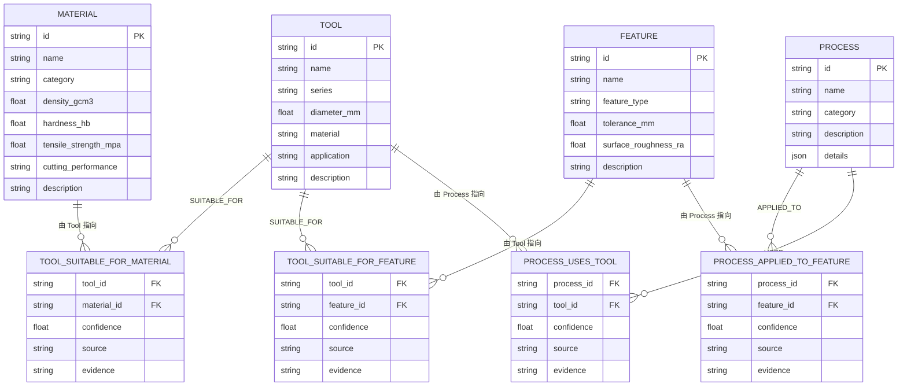
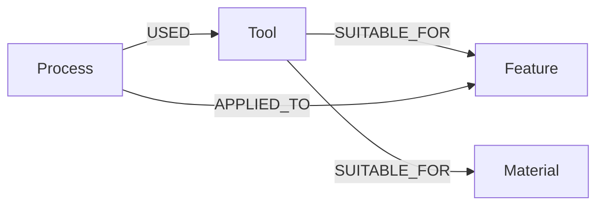

# 知识图谱极简本体设计 v1（M1.1）

> 任务编号：M1.1
> 设计目标：为后续知识图谱构建提供结构化、可校验的极简本体 schema
> 适用模块：工艺知识图谱（参见 `docs/OPTIMIZATION_BLUEPRINT.md` 第 3.2.1 节）

---

## 1. 设计原则

- **极简**：仅实现 4 类核心实体 + 4 类关系，不做任何扩展。
- **类型安全**：全部采用 Pydantic 模型，落地于
  [`python/app/models/knowledge_graph.py`](../../python/app/models/knowledge_graph.py)。
- **容错优先**：除主键 `id` 之外，所有属性均可空（`Optional`）或带默认值，避免数据缺失阻塞系统。
- **可追溯**：每条关系必须显式携带 `confidence`（可信度）与 `source`（来源）。
- **制造业通用术语**：属性命名严格沿用机械加工领域通用术语（孔 / 型腔 / 平面 / 主轴转速 / 进给速度等），不发明新术语。

---

## 2. 核心实体（4 类）

### 2.1 Material（材料）

描述工件材料的物理与加工属性。对应数据源：`python/app/data/materials.json`。

| 字段名 | 类型 | 必填 | 默认值 | 说明 |
| --- | --- | --- | --- | --- |
| `id` | str | ✅ | — | 材料唯一标识，对应 `materials.json` 的 `id` |
| `name` | str | ✅ | — | 材料名称（如 45#钢 / 铝合金6061） |
| `category` | str | ❌ | `""` | 材料类别（如 `carbon_steel` / `aluminum` / `stainless_steel` / `alloy_steel`） |
| `density_gcm3` | float \| None | ❌ | `None` | 密度，单位 g/cm³ |
| `hardness_hb` | float \| None | ❌ | `None` | 布氏硬度 HB |
| `tensile_strength_mpa` | float \| None | ❌ | `None` | 抗拉强度，单位 MPa |
| `cutting_performance` | str | ❌ | `""` | 切削加工性能评价（`excellent` / `good` / `fair` / `poor`） |
| `description` | str | ❌ | `""` | 材料描述 |

### 2.2 Tool（工具）

描述加工用刀具的几何与用途属性。对应数据源：`python/app/data/tools.json`。

| 字段名 | 类型 | 必填 | 默认值 | 说明 |
| --- | --- | --- | --- | --- |
| `id` | str | ✅ | — | 刀具唯一标识，对应 `tools.json` 的 `id` |
| `name` | str | ✅ | — | 刀具名称（如 麻花钻 φ3mm / 立铣刀 φ6mm） |
| `series` | str | ❌ | `""` | 刀具系列（`twist_drill` / `endmill` / `face_mill` / `center_drill`） |
| `diameter_mm` | float \| None | ❌ | `None` | 刀具直径，单位 mm |
| `material` | str | ❌ | `""` | 刀具材料（如 HSS / 硬质合金） |
| `application` | str | ❌ | `""` | 典型应用场景（如 钻孔 / 型腔加工 / 平面加工） |
| `description` | str | ❌ | `""` | 刀具描述 |

### 2.3 Feature（特征）

描述工件上需要加工的几何特征，是 Process 与 Tool 共同作用的目标。

| 字段名 | 类型 | 必填 | 默认值 | 说明 |
| --- | --- | --- | --- | --- |
| `id` | str | ✅ | — | 特征唯一标识 |
| `name` | str | ✅ | — | 特征名称（如 孔 / 型腔 / 平面 / 轮廓 / 槽 / 螺纹） |
| `feature_type` | str | ❌ | `""` | 特征类型（`hole` / `pocket` / `face` / `contour` / `slot` / `thread`） |
| `tolerance_mm` | float \| None | ❌ | `None` | 尺寸公差，单位 mm |
| `surface_roughness_ra` | float \| None | ❌ | `None` | 表面粗糙度 Ra，单位 μm |
| `description` | str | ❌ | `""` | 特征描述 |

### 2.4 Process（工艺）

描述加工工艺步骤或规则。对应数据源：`python/app/data/process_rules.json`。

| 字段名 | 类型 | 必填 | 默认值 | 说明 |
| --- | --- | --- | --- | --- |
| `id` | str | ✅ | — | 工艺唯一标识，对应 `process_rules.json` 的 `id` |
| `name` | str | ✅ | — | 工艺名称（如 先粗后精 / 先面后孔） |
| `category` | str | ❌ | `""` | 工艺类别（`sequence` / `parameter` / `fixture`） |
| `description` | str | ❌ | `""` | 工艺描述 |
| `details` | dict | ❌ | `{}` | 工艺细节参数（如余量范围、依据等结构化字段） |

---

## 3. 关系定义（4 类）

所有关系均继承公共基类，必带以下 2 个属性：

| 公共属性 | 类型 | 默认值 | 说明 |
| --- | --- | --- | --- |
| `confidence` | float ∈ [0, 1] | `0.5` | 关系可信度，1 表示完全可信 |
| `source` | 枚举 `RelationSource` | `rule` | 关系来源，可选值：`rule` / `llm` / `实测` / `manual` |
| `evidence` | str | `""` | 关系证据描述（出处、统计样本、人工备注等） |

`RelationSource` 枚举值说明：

| 取值 | 含义 |
| --- | --- |
| `rule` | 由既有规则推导（如 `process_rules.json` / `materials.json`） |
| `llm` | 由大模型从文档中抽取得到 |
| `实测` | 由车间实测数据统计得到 |
| `manual` | 由工艺师人工录入 |

### 3.1 (Tool)-[SUITABLE_FOR]->(Material)

> 表达"某刀具适用于加工某种材料"。

| 字段 | 说明 |
| --- | --- |
| `tool_id` | 起始端 Tool 实体的 `id` |
| `material_id` | 目标端 Material 实体的 `id` |
| 公共属性 | `confidence` / `source` / `evidence` |

### 3.2 (Tool)-[SUITABLE_FOR]->(Feature)

> 表达"某刀具适用于加工某种几何特征"。

| 字段 | 说明 |
| --- | --- |
| `tool_id` | 起始端 Tool 实体的 `id` |
| `feature_id` | 目标端 Feature 实体的 `id` |
| 公共属性 | `confidence` / `source` / `evidence` |

### 3.3 (Process)-[APPLIED_TO]->(Feature)

> 表达"某工艺用于加工某种几何特征"。

| 字段 | 说明 |
| --- | --- |
| `process_id` | 起始端 Process 实体的 `id` |
| `feature_id` | 目标端 Feature 实体的 `id` |
| 公共属性 | `confidence` / `source` / `evidence` |

### 3.4 (Process)-[USED]->(Tool)

> 表达"某工艺使用某刀具"。

| 字段 | 说明 |
| --- | --- |
| `process_id` | 起始端 Process 实体的 `id` |
| `tool_id` | 目标端 Tool 实体的 `id` |
| 公共属性 | `confidence` / `source` / `evidence` |

---

## 4. 本体关系图



> 简化视角的图谱连接图（与 3.2.1 节蓝图一致）：



---

## 5. 落地说明

- 模型文件：[`python/app/models/knowledge_graph.py`](../../python/app/models/knowledge_graph.py)
- 公共导出：`Material` / `Tool` / `Feature` / `Process` / `ToolSuitableForMaterial` / `ToolSuitableForFeature` / `ProcessAppliedToFeature` / `ProcessUsesTool` / `RelationSource`
- 导入示例：

```python
from app.models.knowledge_graph import (
    Material, Tool, Feature, Process,
    ToolSuitableForMaterial, ToolSuitableForFeature,
    ProcessAppliedToFeature, ProcessUsesTool,
    RelationSource,
)
```

- 所有关系字段均允许缺省（`confidence` 默认 0.5，`source` 默认 `rule`），可由后续数据补全流程在写入前显式赋值。
